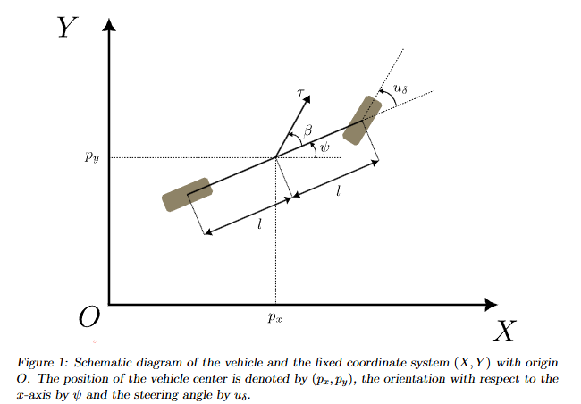
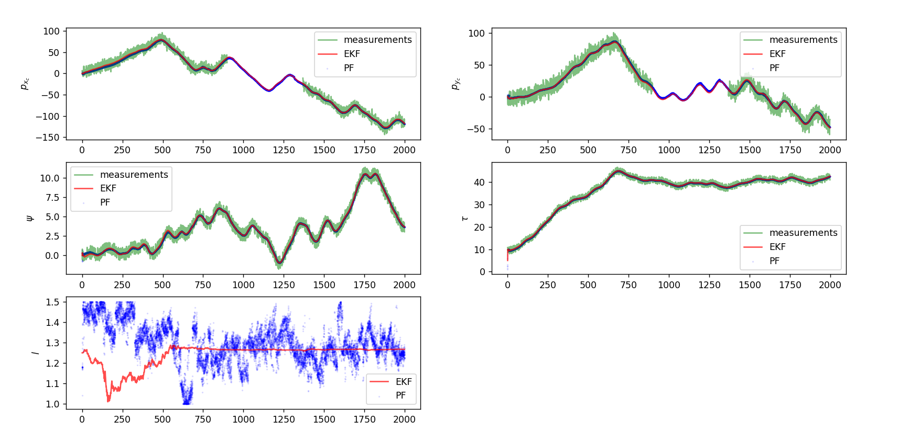

## Recursive filtering project
This small project is related to the implementation of a EKF and a particle filter in order to estimate the the position of a vehicle via GPS, gyro and accelerometer.

Here is a representation of the vehicle (bycicle model):

Here are some results of the two algorithms (x, y, orientation, speed and vehicle length):
